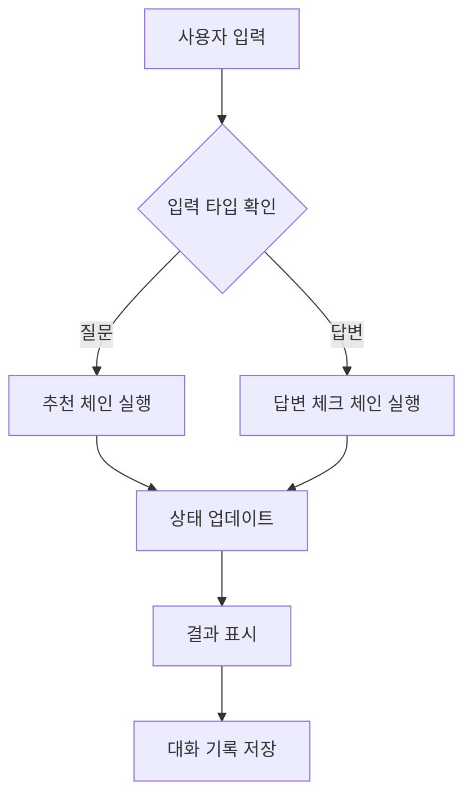
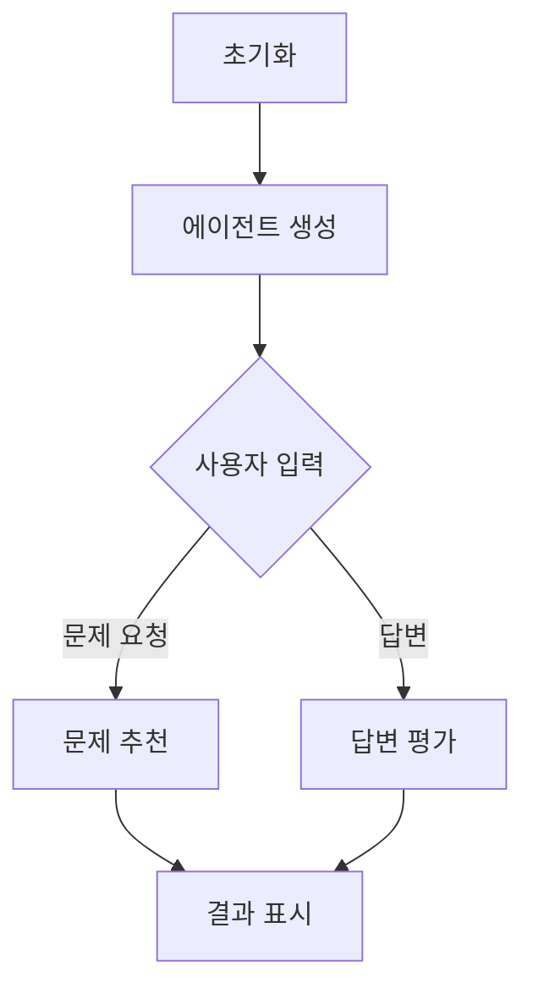
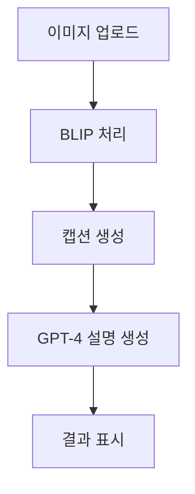
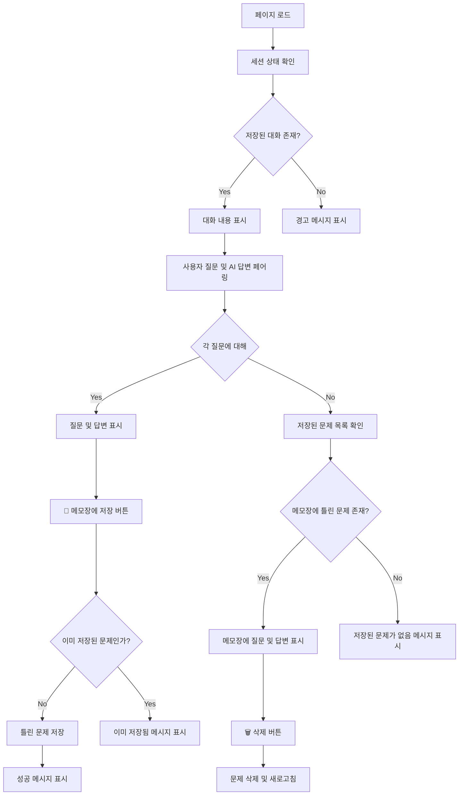
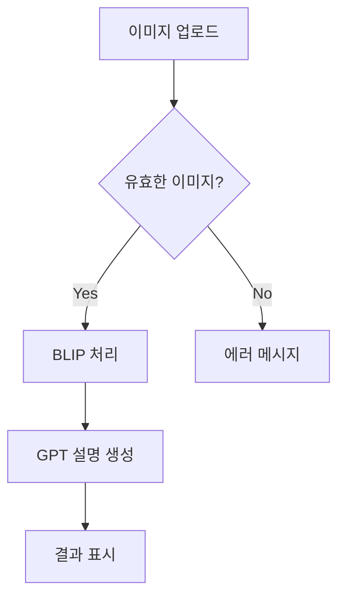
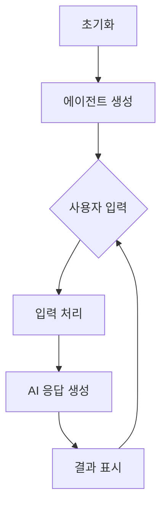

# 무면허라이더 - AI 기반 운전면허 학습 도우미

## 팀원 소개
###  팀원 닮은꼴 소개 
|김원철|박규택|이주원|정재현|허지원|
|:---:|:---:|:---:|:---:|:---:|
| |<img src="data:image/jpeg;base64,/9j/4AAQSkZJRgABAQAAAQABAAD/2wCEAAkGBxITEhUTEhMVFRUXGBgZGRgYFhcXGRYXGBcXGBcaFRgdHSghGh8mHRgWITEhJSkrLi4uGB8zODMtNygtLisBCgoKDg0ODw8PDysZFRkrNzc3KystKysrLSstLTcrKysrKysrLSstKy0rLSsrKysrKy0rKzcrKystKysrKysrK//AABEIALkAowMBIgACEQEDEQH/xAAcAAAABwEBAAAAAAAAAAAAAAAAAQIDBAUGBwj/xABFEAACAQIEAwUEBgcGBQUAAAABAhEAAwQSITEFQVEGImFxgRMykaEHQrHB0fAUIzNSYnKCNHOSorLxFSRDU+FEY6Ozwv/EABcBAQEBAQAAAAAAAAAAAAAAAAABAgP/xAAaEQEBAQEBAQEAAAAAAAAAAAAAAREhMRIC/9oADAMBAAIRAxEAPwDszVW8ZXFEAYdrQ658xP8ATGnyPlVnREVz0vWftretd+7aa6R9ZbguZRzyoVX5CausLfV1DKdCJHWPEdfOoeP4zZtSGcZgJyiS245AeVK4AyG0MjKwlmOUgwXJYqYOhExB6VFixoCaWaBNFR8Xh1uIyOoZWEFTzFZ/ifZCyQDhwlpwS3Mz3GQA69SDPhWmoVRQ2+zFgra9quZ7aKkguAwXbMAdRIG/Sn24QTi/bnKU9l7PLBkkMWk6Vb0DUKzGK7KZkvL7Zg1x7jjIcq95YysBqwjpRHso7JbVsVcAt5CFULlVkUAFZE9fjWooRRGf4Z2eayzsuIuNnLMysq5Wdh9aFFWvDbLrbQXCpYLByDKs/wAI5VMFA0U2aMURo1oabxV4IpY7Dl1OwAqCvDhcZbl/vEHMF+qh8Op5TWZ+krjVywcOLRg5i/WY0EjmNTSuy/bYX2Fu6FVwvur/ANVv4enPQ0K3U0l6RbuEjUEeBifkSKcoE0KFCgOiNHRGjOGLOHVCSqqsmSQAJ8yPWonDrYN27cUDKcqzEZisgn5x/TTGNa/elbUW0Eg3GBzEDf2a6R07xrJ4ZcVjLrJh79y3Yt90uMqyeiBRETsTOlB0ihWXwGHuWLht2Xu4g5RmNy5KqZ0zMQY7vICrj2N8jW6qz+6hJ+LMZ84oqcTQqssYwo1xLzA5ArBoygq8jUcoKkaURxV9oNuyMu/6x8hInkAraRyJEbUFoaKomAxWdQSCp1DDeGBhtRpUomPzFEKoxUOzxC07FUuIzDcBgSOs66VHfjSAnKl1lG7Lbcr/AE9Y8KNLQmkZpqM/EbfsxcU5lO0bsdgB4k6Qajtjb66tYOSdMr5njrkyjx0mgsTQDUxYxSOudGkfAjrI5H4VCwmH9t+scuFYd1FdkAWNJykFjz9aloxf0uYc/qLnLvKfUKR99c8tuVMjcfkV1X6QuEAYQsruVRlJVmNwRMGJkjQnnXJo+O3mQADWpNR2DsP2kfFILbFVuWwMxJkuNACB11E+lbE15+4LxJsPdW6m6nadxzB11keddz4RijdtrcIQBwCuVs2nSco2qVU2hRzQqAqOioTFUZL6QeI5bQsqCbl0qE066Zg3XWI8avOz/DFw9hLSjUDvdS/M1mryHE8WCtBTDLOm0mCJ8ZY1Zdoe1HsHFqzaa9fInIoOg5FiOutEaDCYZba5UECST4sdSfWnzWFwH0hAObeLsmyeokgdMykT61tbdxXUOrBlIkEagjwPOioB4ZmxJvOZUIgRejKXJY+MMB6mrKNTRmk1E1TcT4dbTNiAD7RWDySdBKhwJ5EAmOtSLqC+5DfslMET77DeeqjaOs1I4jbzWbi9Ucf5TTXA5/R7ROpZAx827x+ZNVDPGOGs1v8AUQtxfc5CCCpXwEEn0FWGHtBVCgaAAD00pwmqDtP2ps4QQe/dIkINCf5ua0VLucOIvrcUjJ3mdT+/lIVx0OuvXSrQ+ImuZYV+K8Rl0uGxakxDNbX+mBLVaYWzxPBnM7fpVqe8JLMo6gsJEdO96UVe8cw5tJcu2pkqwdR9eRAb+YaDyJqzwTq1tGXYqCPKNB6bego8NeW4iuveVhI8QRPz0NHhrKoMqgBRsB8fvrN9Fd2rScHiP7tvsrhMV3ntS3/J3/7tvsrgxrf58Qa8jXS/ox4vca2cOFQqhBku4IQ9BlIJmeYrmQrS9gOJ+xxaTOVwVPdJ31G3iBSjtU/nShSVYESOfUx8o0oVhS6RdOh1gdZiPEUhsQvUULjjKSQT4ATNVlk+xoHtcbdJn9cVzHmFk8txJB9KuOA8L9nnvOJu3iWadwpMqnpVZ2Guz+lrBEYm4ZPjGkcoj51qhQVfHeAWcUmW4O9EK495enn5Vi+EY2/wvEewxMmw57rRoNdGX8OU10qoPG+FW8VaNq4N9Q3NSNiKKmq4IkEEEAyNo5QedGKxfZbHXMNd/QMSdR+yf99ddK16X1LFeYE+lVC7qypHUEfEEffSMHYyW1SSQqhZPPKKcbYnoKo+M9qLGHtC6ZbN7oG5O5E8t96BHbDtGuEsyNbrjuLPWdSPCsh2U7N3cWxxGLYlGOfKZBukRBPRfwFPdneAvjrpxmL9w+6nJo2H8o6c9a6I7pbWdFVRz0AA8OlTQq3bCqFUAACABoAPLlSorM4ntRr+rRY5Z/aEwf4baNHWDr4UnB9q595FYDc2nzFR1a26q4+FTWl/hcNkzQTBJMfuk+8B5nX1p9aaweKS6oe2wZTsRTwoKbto8YK+f4CP8UD764Yfw+wV3PtphrlzB3UtKWYgQBuYYEx8K4ddQgwwIPQiDz3rcQmp/AsRkxFp9O7cQ+mYTVfTlo6jzFW+D0LbOcBlIIOxoULZ0FCuag+FSIjSkHDR7p11gHUTykaT8RUikXTAJ125b+lVmqjs3hPZi8CZLX3YkCNTlOmpj4mnuNcTZClqyA164SFB2Uc2bw/EUXBYi57xHtD725lV978KquBEXOIYu8f+mFtDwgS1USMT2dLLmvYu+X/eVlRF6BVC7T4zUHAcQvYW+tm9dW/YuHKtwEEox2FyORgjelYLii4niN205GSwvcQiZuTDFhz8B41I7f4Sz+iXHcAMsZG2IMqInnpNBP7R8FXE24nJcXVHnVG5T4fjTfZ/ht20ZusrELEgkkkkE/CCKV2R4n+kYS2596Ib+YaGauaAyPzpVFe7L2LkC6M6glgp0EyTrHnEdMtXlKNFhkIFAAAAA0EbAbAVRY+2cViDaJPsLRBuQY9pcIkLO+UAgnzFX95oBY7ASekDUzULhNmLSkjvMc56yxLQfKs1cV+L4utq6mEw6KbpExGVLa/vNGvpoaq+03A7xtm8txWu2xIYILbKRqcrAyeRhp86ytjtD7Did2/cBK5rimOQ1WfkK0PaLt3hzYdLBZncEarlAB3JnWasgj9jOPAtmaFzsEuj/wBxgcl0DbvRlbxFdDrh3Z62RnbZYKn+YBrqz62/trt9hpVT1APxpYhwVj+3PZRMRba9bWLyidBpc6hus9a2FBhRXnAjy/PWn8Cma4q9WUfEgVI49YCYi6ixC3HGnQMaf7M2gcRZLQFFxSSTAADAnX0rSO7QKFEtwETqfEQR6GjqYuHKi4vEqkSCSToFBZj6CpDVVWmJW5f3JVgg6Ko7oHgx19alZO8GdWQuoIDszajKSJgEjxAFUXYsFb2MU6E3S2vQl9fz1rTWLWVVUDYAfAAD8+FKt2VzE5RJ3MannqaDi2N4bihicQ9tLn6u45LKD3ZMj5EUi5ax+Ntlv1t5bcaEk7TPd511+/hrlt2e0A2eM6SFLEfWSdJIOoOmlN5rzgolprIOhdivdnQlFDMSfHQeNFVv0c4BrWFE7PDwdwxkEnzAX51qabsWwihVEACBz25bnajt4hSxQHVYkdJoFmiU0s0S7VVw3etB1KmYYQY8aMLA/PSlim1ugkgGSN6gxb9jrF65is8+1Lsyye6ofvBlHOTInwql4X9HVz2v/MsvsgD7pMsYOx+rXR8Thg5kEqwkBliQNJBkEEbaEVFfhrNIe/dZTyBRQRzkqon4iiMt2e7KBVu288r7Yw3NgqMmg6y0elbiwoAAGwAHwqPgrloApbKxbOUhdlO/xqUKgcoNQmmMbcy23bopPyqq5lwLs5+mYu/eufslutMfXbNsDy1M+ldNtYdFXKqKFGyxoPTzmonAcALOHS2OQkn+Ju8T8T9tU7cWa7fZEY27aKCCADn1ZSSCDK90xSosL3ZuwzE/rVnkrQo8hyoVZYVpQZypaNTtPpQqbTo8a8Ix6KT8jUUJCWre3uD/AA6/YoqXi1lGHUEevKouEuB/ZMNR7OfXQT8mq1GX7eYu+jD2buqgawYMwY++oeH4nfuC2blwpdVoR1GaVOhW4kjN1/8AMgbXE8Ot3CM4mNhrFOWsDaSMqKD5UFXg8diXhcqgz7xtOq+GVS4JiDzFWdrDPpmvMY5KFUH4a/5jUuiilWAxqHw/Cm3nkyGdnGhnvGSGnTTbyqdR0UxatEFiXJk6A7KOQWnDypUUgrJ51Qqk3LYYEEBgdwdRS4oqgy3EuzbM82xbQakFc1lgdNZUwfhVNisDxK2GBNxkg7XpgeJgk9OW1dCmkt/vtU1Mcg4fxTEWpt2ZgtMKupn35Y7kdY5V0zs4bvsl9sZaN9Nd9ZgTy5VItcOtK2YW1DdY1+NSlq6HKIjT86+FCgaqqnj+JyqLa+88j+VAO8x9NPhVPwHBMzG5qFaANPqr3V5DoT/VR4m4cRiXRDMQkj6iDVm8yZHnWpw9kIoVRAAEeX5++paHAKFMNfAMFvydaFQOlutVPDgUv3LR2ALIeRUtJE+DMR8KtRvFQ8c+V7bzs2VvJ9B/mC0ZTaANFNBagou2HFmspaW22VrlxUnSQs6xOnTerF8NdCzbvtMCM6qQY2mFU/A1j/pWVguHuDZWM9Ae6Rz02pfC/pEsFUW8ro2zNAKj+LQzroa0satP0kaTZJ5mHHy1+00636RGptD0c/eKbwHGLF0fqrqN4Bhp5jcetTw461OxUMNiD/2h4977KBXE8nsj+h2//YqbNCabTUNLF/691P6bWX/U5+yjODze9cuEeYX5oB9tSQwpq/i0USzKB4mKZTTP/DbQHuA+LS59XYk/Oo7YUW7tsoSquWVlnu+4zSF2B7vzNQ+JdsMFaBm8rNqMqSx6bjT5iqHBdrzisZYtohS3mJMmWJyOBtoNJ0k0yo3tEtCiWgdpjG3slt3P1QT8AfvinXbSelQbym7h1G+cW59SC3yqqVwrAJaQBVAJALaaliJJY+c1LZwASdhR1ScRxAut7MaorDP/ABHcIvgN6lFde4XdvMbpfLmMgdF2XlzUA+tCr72/iR4DahUD2Y9Y67Qdttdqbx9jOhQj3hqRPxHiOXjFF7UQQNY3Ov3Ulb4JMD01+XLaedEwOE4kune99TlbzHMDod/XwqaKocRmtP7ZQSDo6rpIH1h4gfKaurF9XUMhBU6gjYjqPCrBUdtOHe3wlxR7wGZfNdfsBrh4+yfz+eUV6KauIdquDtaxj2kBIYhkA6OdB6aj0rUopFPOpWGxV73bb3PJSfurXWOxCrkS6xN11JKg6IB15E67H7qv+GcKtYdRkQeZ94/zE/dpWtgwyHiQE5sSB/M4+w1DxHF8WDD3rwI6u34zXV1uK241qv4ngFcZSAZ5kAkDwqbEczGPxL6e1usegZ/up0cHxTa+xuH4n7TXT8JgbKLCKqdDlAPjJ5z1p0nLqKujk17hOIXU2XHpV/8ARvhScaJB7qsxkfwlftYVvg6sNR50ns5aQ3b1xQO7CT+827a+HdHpWbVjQFNaWBFAGonEOIpaGupPuqN3PTw6zUCONY/2Sd0ZnYQq9T1PgNz5RVTwvFX7FsIAtxQNMzMrCI55TpMkDkDQw7Esbt0gudNPdVRsAOXj19BUnutoBQEcTdvSGYW0/gJk7aM5A08qkWVtqMq6Aac/PT4771HfTuilLYI20qVTjYWd2PxoU4kxvQqIZnXXbbroNqk2lHTX48qgtdnaRvRrcjkT86uCebg5iRGuh/A1TF2ssWsjQmWtT3T1Zf3WOs07lJJ/Jo/0Yk6nTzn7KFqywHE7d4dyQw3RtGXzHx1EioHHOFqblnEhSXssCQN2Qggj0maj3eHoRJ0I2YaEeo1FKt42/ajX26DczkuDyPut/l3qoVxjCM5TEWYuDLBA5qTIK6jXSImog4ig0uk2yeVwFD89PQExTtjiFomcPdFtzvZugqs6TlnY9SMw+62/4iFEXrbITrMZ1886zHqB5UVSEqdUZSOUEH51IskHRoNTFXAvuMOSfC2SflrT44PhNxZteeUVUVF/KmuYAeOn20mzisw7iO55ZQSD/XovxNWrphbLaixbbkYRT+NOnGs8iyhb+JwUQeRMM3oCPEUqqK7gLk5WOUsDlthgXI01YjQKOe/KtDwzALZtraTQKI8zuT56/ZSbNtbcvccZj7zscunIdAPD7aqeI9pdVWyIzz+tYQoCgkkAnvbbzFQWHFeKLZgCWuH3UG58STooG5Pw1iqXC2yWL3e9cbc7AD91RuqjoddZ50eHt5tbaO7HU3HBAY88zNAIjoPhzeGAxAOiL4D2kacvqVcEhsNMU0bbA/P8/GlEX10Nlm8VZD8jH2UhcaNmS4v81tx8yIqCTh+rVJsXdar/ANMtvCq6n+oA/An7qsrdmPXyqU1NgUKaFo9fnQqCvWyBrvSrtwVEBbLOvzozZMa1tAN+D50h7p5cqXbsjnS4XnUEbMxIPSjNomJqS11RpTZxE6afj4VQxdwSsIYAjxE00nDAv7N7luOSMQB/T7tSDcMSf9vz41m+N9r0tHLaHtH6zCj15+mlMF6yXj711Ln99aQ/6YqvxGLVGCNhsE5ZoGUZTPIkZTzj41ibvaK+7S+q8lMhemwIkaVf8JwrMlp3tW0LXFYBVglRLEs3w51cGu4fi2U5Vw9m0p/caZ66ZBroedTTjXEwAPDXbnVHxTitiwAXeDyUAFtI5fnesnxTttecFbSqgO50LHy6Uwb3iV5WWXZcoIMMywD4A896x/anjlh1BtXQbitpAJ0aVMdD5+NYrE4h7hl3Zj4kmnrHDbziVtXCOoVo+J2q4FHid/8A7tyTzzt4TGumwp1eP4pdr90eTt+NQLiFTDaRvzj8+NbPsxwXh2IRsz3EZSASzos6HYdKoz69psaNsTd/xmpVjtnj1/8AUMfMIZ85BqV2i7GtYGe1cW5b33GaPL63pWUpwau327xJ/bLavjpctj5EetWeB7bYaAHwuUdbdxh5wJEVgqWikkACSdABuT4DnUyDplvtdw8jUX1PQ3Lhj/5KKsza7J3IGe7aRuas5zL55dJoqZB0dsRGm9Ia/P8Av+fhUFakHar8rhWYn8xShaPL/wACmbW5qZ9UUxcNDD+n51oygG8SPz+fSiao96mGMv227QETh7R3jOR47Dr0mKLsn2QF3v3wfKNF6a8z4chWZf8Atf8AX99da7Nfsz/e3f8A7LlMRz36SLWTFBVXKgtplA2MyWj5VBu9qsSUCK4RQoUZVgwNta0P0q72fKsQnu+lMDbFmMklmPqSfzyq+4T2Vv3e84yL8WjwHKmOzH9oXy/Cug2N/T7xQQ+G8CsIABbBbmTrJnSDz1+cVW9ru0BtA4e0e9szAyR0E9d5rSW965bxX+0XfM0EAr1Gs+lWfBOCvfJjREBLsYAEeB0NVrbjz+41tuz/AOwu/wBzc/0mmCs4vxK0rm3bGcKGQFspkZjz1nToR5VWXcEbiG8i9wQCAxJSF+sp1A8ai8m9P9Iq87HftX/kb7KuQZ9VGmu/hMedb7s5wMIABC3SBnuzPs51yWv4oIluU1h8P7y/zH/UK2mO/s4/mNT5g1NvhllRAy6dRJPiTz86FctubmhTIP/Z"  width="150" height="150"/> |  |  |  |
| 
 면허 있음 
 | 
 면허 없음 
 | 
 면허 없음 
 | 
 면허 있음(셀카임) 
 | 
 면허 없음 
 |
---

## 프로젝트 소개
AI 기술을 활용한 운전면허 필기시험 학습 도우미 서비스입니다. 사용자의 질문에 맞춤형 문제를 추천하고, 답변에 대한 상세 해설을 제공하며 교통 표지판 인식 기능을 포함합니다.

## 주요 기능

### 1. AI 기반 문제 추천 시스템
- Multilingual-E5-Large 모델을 활용한 텍스트 임베딩
- 코사인 유사도 기반 맞춤형 문제 추천
- 실시간 대화형 인터페이스

### 2. 지능형 답변 평가 시스템
- GPT-3.5 기반 답변 정확도 평가
- 맞춤형 오답 해설 생성
- 단계별 학습 가이드 제공

### 3. 교통 표지판 인식 시스템
- BLIP 모델 기반 이미지 캡셔닝
- GPT-4 활용 상세 설명 생성
- 실시간 이미지 처리

## 기술 스택

### Frontend
- Streamlit
- PIL (Python Imaging Library)

### Backend
- Python 3.8+
- OpenAI API
- Transformers Library

### AI/ML
- BLIP (이미지 캡셔닝)
- GPT-3.5/4 (텍스트 생성)
- Multilingual-E5-Large (텍스트 임베딩)

## 코드 리뷰 및 아키텍처 분석

### 주요 컴포넌트 분석

### 1. Core Components

#### app.py (메인 애플리케이션)
- Streamlit 기반 대화형 인터페이스 구현
- 상태 관리 패턴을 통한 사용자 세션 관리
- Chain 패턴을 활용한 모듈식 설계

#### chatbot_langchain.py (LangChain 통합)
- LangChain 기반 AI 에이전트 구현
- 문제 추천 및 답변 평가 통합
- 세션 기반 상태 관리

#### car.py (이미지 처리)
- BLIP 모델 기반 이미지 캡셔닝
- GPT-4 통합 설명 생성
- 이미지-텍스트 멀티모달 처리

### 2. Chain Components

#### wc_chain.py
- 문서 로딩 및 벡터화
- 임베딩 생성 및 저장
- 컨텍스트 기반 응답 생성

#### answer_check_chain.py
- 답변 정확도 평가
- 맞춤형 피드백 생성
- 오답 노트 관리

### 3. Utility Components

#### embedding.py
- 텍스트 임베딩 생성
- 모델 최적화
- 벡터 연산 처리

#### find_similar_question.py
- 코사인 유사도 계산
- 문제 추천 알고리즘
- 데이터 전처리

## 페이지별 플로우 차트

### save.py (틀린 문제 저장)

### car.py (이미지 인식)

### chatbot_langchain.py (AI 챗봇)

