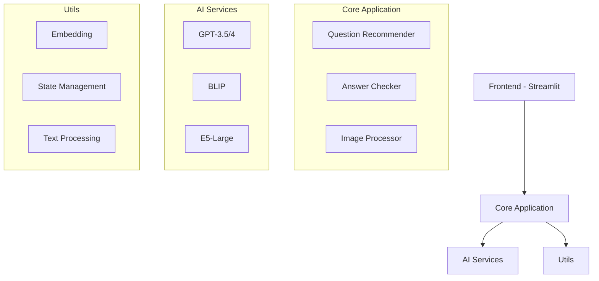
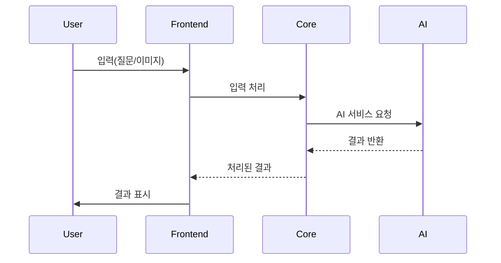
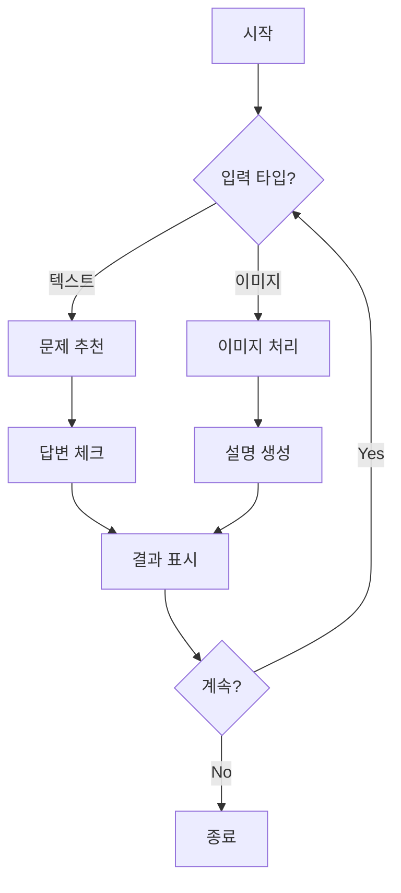

# 무면허라이더 - AI 기반 운전면허 학습 도우미

## 프로젝트 소개
AI 기술을 활용한 운전면허 필기시험 학습 도우미 서비스입니다. 사용자의 질문에 맞춤형 문제를 추천하고, 답변에 대한 상세 해설을 제공하며 교통 표지판 인식 기능을 포함합니다.

## 주요 기능

### 1. AI 기반 문제 추천 시스템
- Multilingual-E5-Large 모델을 활용한 텍스트 임베딩
- 코사인 유사도 기반 맞춤형 문제 추천
- 실시간 대화형 인터페이스

### 2. 지능형 답변 평가 시스템
- GPT-3.5 기반 답변 정확도 평가
- 맞춤형 오답 해설 생성
- 단계별 학습 가이드 제공

### 3. 교통 표지판 인식 시스템
- BLIP 모델 기반 이미지 캡셔닝
- GPT-4 활용 상세 설명 생성
- 실시간 이미지 처리

## 기술 스택

### Frontend
- Streamlit
- PIL (Python Imaging Library)

### Backend
- Python 3.8+
- OpenAI API
- Transformers Library

### AI/ML
- BLIP (이미지 캡셔닝)
- GPT-3.5/4 (텍스트 생성)
- Multilingual-E5-Large (텍스트 임베딩)

## 코드 리뷰

### 주요 컴포넌트 분석

#### app.py
- Streamlit의 세션 기반 상태 관리로 사용자별 독립적 컨텍스트 유지
- 체계적인 메시지 처리 시스템
- 타이핑 이펙트를 통한 자연스러운 UX

#### car.py
- BLIP과 GPT-4의 효과적인 통합
- 실시간 이미지 처리 및 설명 생성
- 세션 기반 이미지-텍스트 대화 관리

#### embedding.py
- transformers 라이브러리 활용 최신 임베딩
- 효율적인 텍스트 벡터화
- torch.no_grad() 통한 추론 최적화

#### chains/
- 단일 책임 원칙 기반 체인 구조
- 효율적인 의존성 관리
- 재사용 가능한 모듈화 설계

#### utils/
- 체계적인 상수 관리
- 효율적인 유사도 계산
- 타입 안전성 보장

## 시스템 아키텍처

## 실행 순서도

## 플로우 차트

