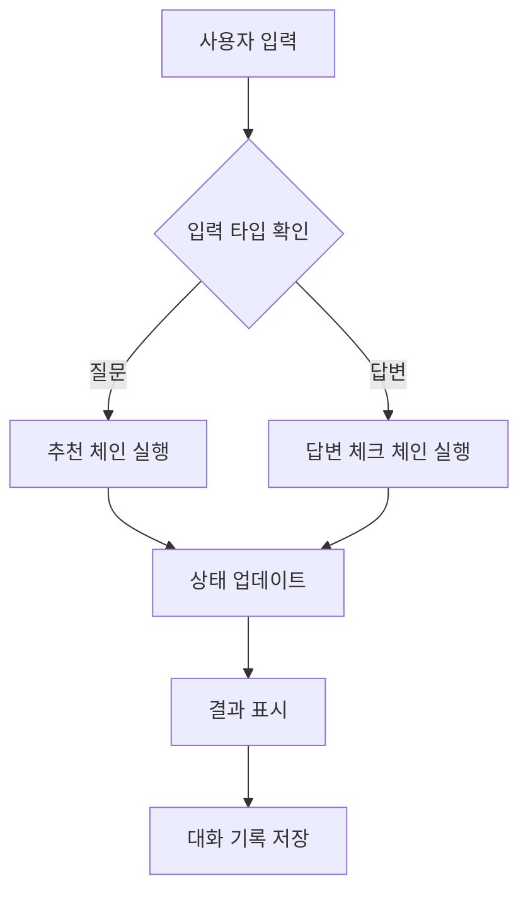
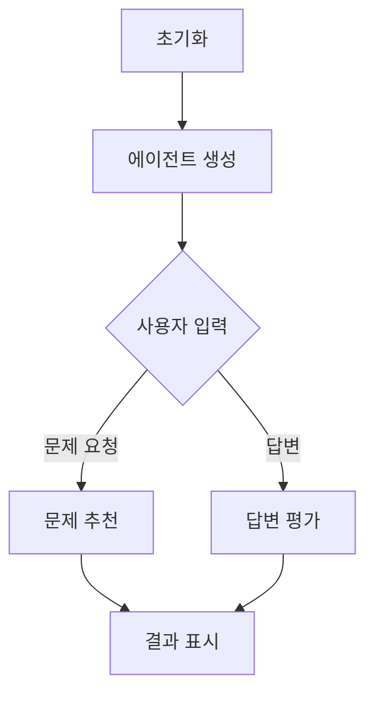
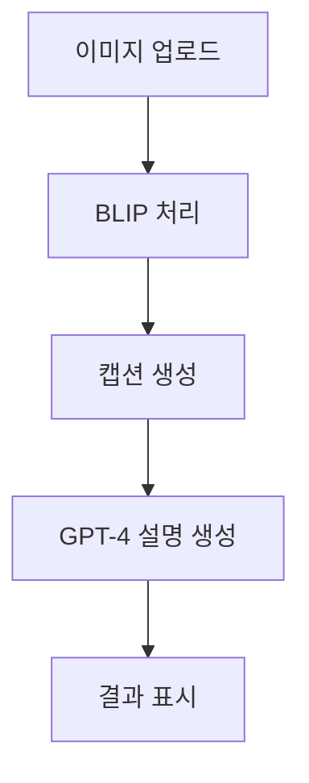
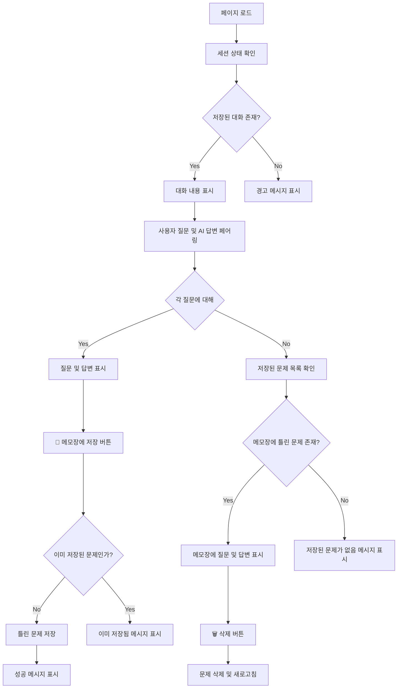
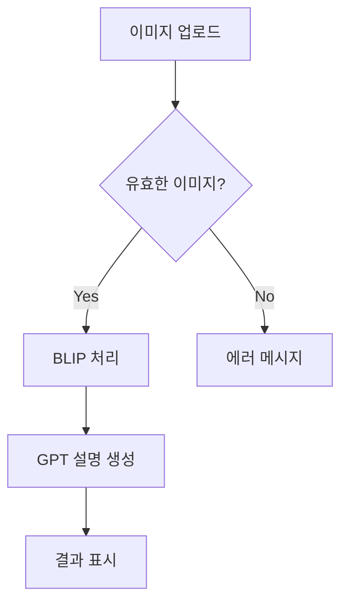
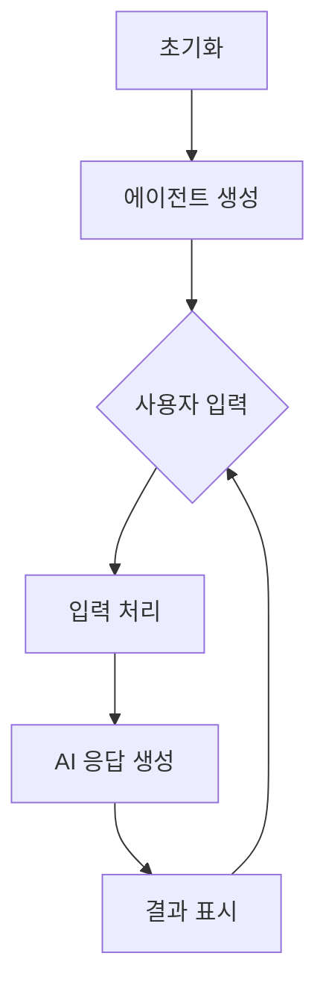

# 무면허라이더 - AI 기반 운전면허 학습 도우미

## 프로젝트 소개
AI 기술을 활용한 운전면허 필기시험 학습 도우미 서비스입니다. 사용자의 질문에 맞춤형 문제를 추천하고, 답변에 대한 상세 해설을 제공하며 교통 표지판 인식 기능을 포함합니다.

## 주요 기능

### 1. AI 기반 문제 추천 시스템
- Multilingual-E5-Large 모델을 활용한 텍스트 임베딩
- 코사인 유사도 기반 맞춤형 문제 추천
- 실시간 대화형 인터페이스

### 2. 지능형 답변 평가 시스템
- GPT-3.5 기반 답변 정확도 평가
- 맞춤형 오답 해설 생성
- 단계별 학습 가이드 제공

### 3. 교통 표지판 인식 시스템
- BLIP 모델 기반 이미지 캡셔닝
- GPT-4 활용 상세 설명 생성
- 실시간 이미지 처리

## 기술 스택

### Frontend
- Streamlit
- PIL (Python Imaging Library)

### Backend
- Python 3.8+
- OpenAI API
- Transformers Library

### AI/ML
- BLIP (이미지 캡셔닝)
- GPT-3.5/4 (텍스트 생성)
- Multilingual-E5-Large (텍스트 임베딩)

## 코드 리뷰 및 아키텍처 분석

### 주요 컴포넌트 분석

### 1. Core Components

#### app.py (메인 애플리케이션)
- Streamlit 기반 대화형 인터페이스 구현
- 상태 관리 패턴을 통한 사용자 세션 관리
- Chain 패턴을 활용한 모듈식 설계

#### chatbot_langchain.py (LangChain 통합)
- LangChain 기반 AI 에이전트 구현
- 문제 추천 및 답변 평가 통합
- 세션 기반 상태 관리

#### car.py (이미지 처리)
- BLIP 모델 기반 이미지 캡셔닝
- GPT-4 통합 설명 생성
- 이미지-텍스트 멀티모달 처리

### 2. Chain Components

#### wc_chain.py
- 문서 로딩 및 벡터화
- 임베딩 생성 및 저장
- 컨텍스트 기반 응답 생성

#### answer_check_chain.py
- 답변 정확도 평가
- 맞춤형 피드백 생성
- 오답 노트 관리

### 3. Utility Components

#### embedding.py
- 텍스트 임베딩 생성
- 모델 최적화
- 벡터 연산 처리

#### find_similar_question.py
- 코사인 유사도 계산
- 문제 추천 알고리즘
- 데이터 전처리

## 페이지별 플로우 차트

### save.py (틀린 문제 저장)

### car.py (이미지 인식)

### chatbot_langchain.py (AI 챗봇)

