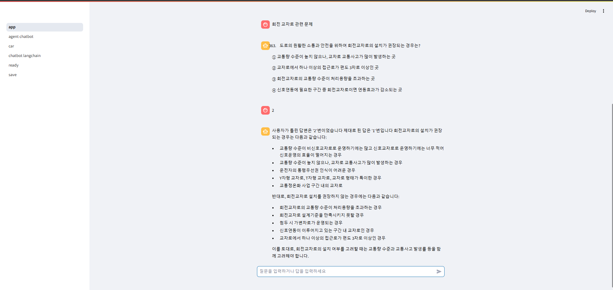
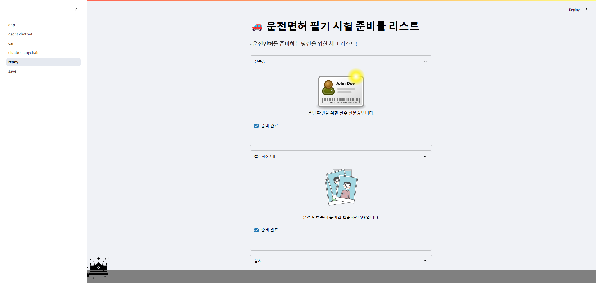
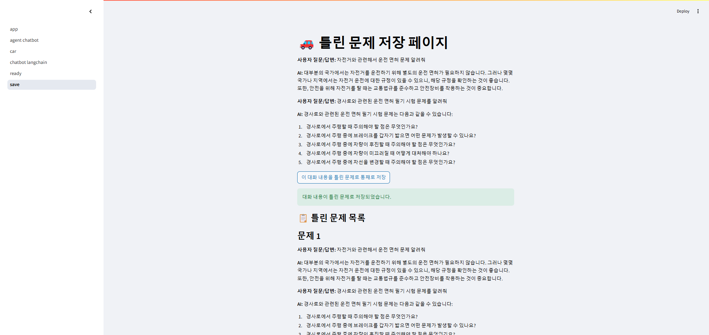
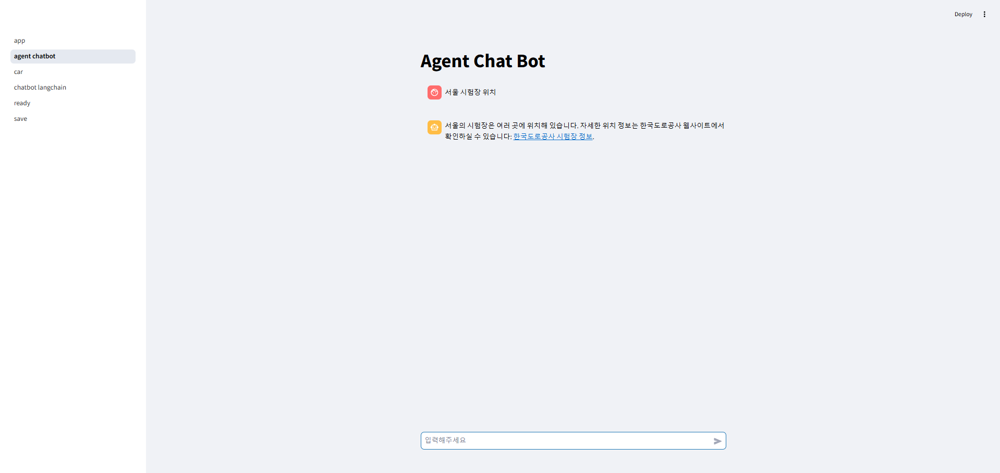
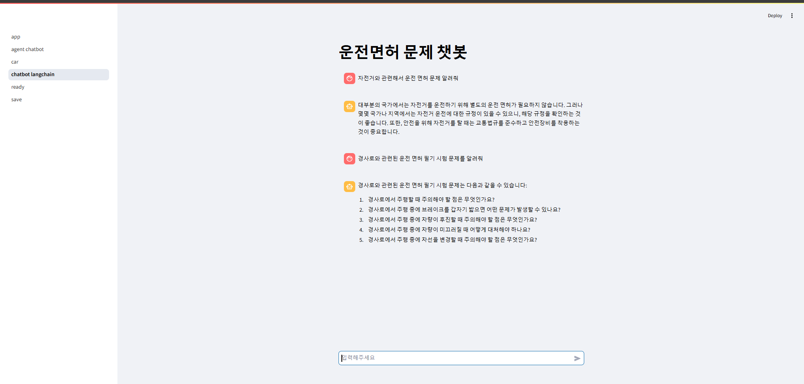
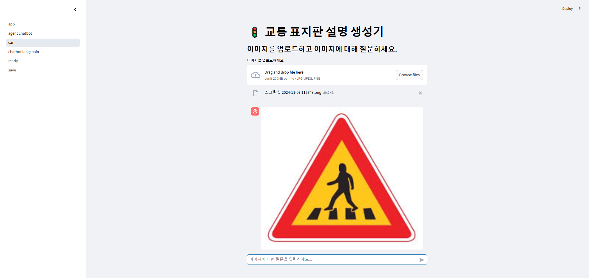
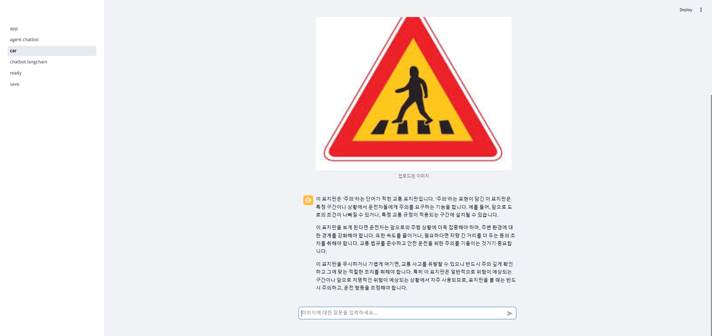

# 무면허라이더 - AI 기반 운전면허 학습 도우미

## 팀원 소개
###  팀원 닮은꼴 소개 
|김원철|박규택|정재현|허지원|이주원
|:---:|:---:|:---:|:---:|:---:|
||  |  |   |   
| <center> 면허 있음 </center> | <center> 면허 없음 </center> | <center> 면허 있음(팀장) </center> | <center> 면허 없음 </center> | <center> 면허 없음 </center> |
---

## 프로젝트 소개
AI 기술을 활용한 운전면허 필기시험 학습 도우미 서비스입니다. 사용자의 질문에 맞춤형 문제를 추천하고, 답변에 대한 상세 해설을 제공하며 교통 표지판 인식 기능을 포함합니다.

## 프로젝트 실행 방법
To install the required packages and run the application, use the following commands:
```bash
pip install -r requirements.txt
streamlit run app.py
```

## 구현 화면

### 메인 페이지 - AI 챗봇
<div align="center">
  
  <p><em>AI 기반 맞춤형 문제 추천 및 답변 평가 시스템</em></p>
</div>

### 준비물 리스트
<div align="center">
  
  <p><em>필기 시험 체크 리스트</em></p>
</div>

### 이전 문제 저장
<div align="center">
  
  <p><em>오답 노트 관리 시스템</em></p>
</div>

### 대화형 학습 인터페이스
<div style="display: flex; justify-content: center; gap: 20px;">
  <div>
    
    <p align="center"><em>시험장 위치 안내</em></p>
  </div>
  <div>
    
    <p align="center"><em>AI 챗봇 문제 질문</em></p>
  </div>
</div>

### 교통 표지판 인식
<div style="display: flex; justify-content: center; gap: 20px;">
  <div>
    
    <p align="center"><em>교통 표지판 업로드</em></p>
  </div>
  <div>
    
    <p align="center"><em>분석 상세 설명 생성</em></p>
  </div>
  <p><em>BLIP 모델을 활용한 실시간 교통 표지판 인식 및 설명</em></p>
</div>

## 주요 기능

### 1. AI 기반 문제 추천 시스템
- Multilingual-E5-Large 모델을 활용한 텍스트 임베딩
- 코사인 유사도 기반 맞춤형 문제 추천
- 실시간 대화형 인터페이스

### 2. 지능형 답변 평가 시스템
- GPT-3.5 기반 답변 정확도 평가
- 맞춤형 오답 해설 생성
- 단계별 학습 가이드 제공

### 3. 교통 표지판 인식 시스템
- BLIP 모델 기반 이미지 캡셔닝
- GPT-4 활용 상세 설명 생성
- 실시간 이미지 처리

## 기술 스택

### Frontend
- Streamlit
- PIL (Python Imaging Library)

### Backend
- Python 3.8+
- OpenAI API
- Transformers Library

### AI/ML
- BLIP (이미지 캡셔닝)
- GPT-3.5/4 (텍스트 생성)
- Multilingual-E5-Large (텍스트 임베딩)

## 코드 리뷰 및 아키텍처 분석

### 주요 컴포넌트 분석

### 1. Core Components

#### app.py (메인 애플리케이션)
- Streamlit 기반 대화형 인터페이스 구현
- 상태 관리 패턴을 통한 사용자 세션 관리
- Chain 패턴을 활용한 모듈식 설계


#### chatbot_langchain.py (LangChain 통합)
- LangChain 기반 AI 에이전트 구현
- 문제 추천 및 답변 평가 통합
- 세션 기반 상태 관리


#### car.py (이미지 처리)
- BLIP 모델 기반 이미지 캡셔닝
- GPT-4 통합 설명 생성
- 이미지-텍스트 멀티모달 처리


### 2. Chain Components

#### wc_chain.py
- 문서 로딩 및 벡터화
- 임베딩 생성 및 저장
- 컨텍스트 기반 응답 생성

#### answer_check_chain.py
- 답변 정확도 평가
- 맞춤형 피드백 생성
- 오답 노트 관리

### 3. Utility Components

#### embedding.py
- 텍스트 임베딩 생성
- 모델 최적화
- 벡터 연산 처리

#### find_similar_question.py
- 코사인 유사도 계산
- 문제 추천 알고리즘
- 데이터 전처리

## 페이지별 플로우 차트

### save.py (틀린 문제 저장)


### car.py (이미지 인식)


### chatbot_langchain.py (AI 챗봇)

