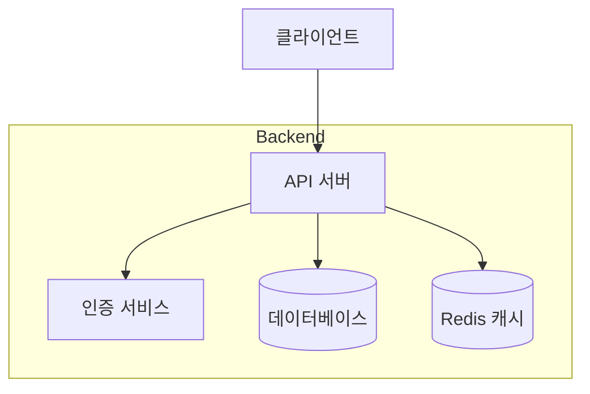
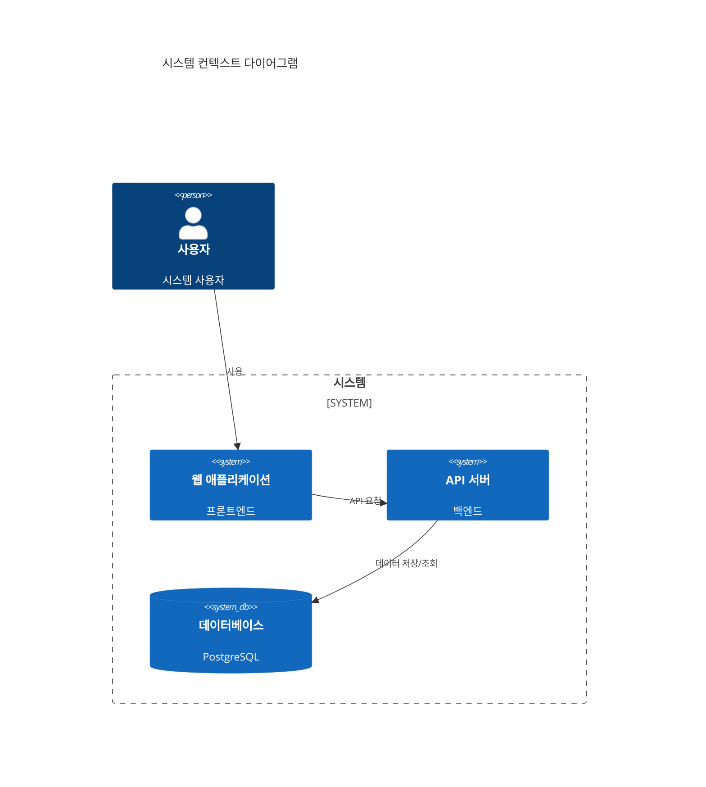

# SKN03-4th-3Team
팀명 : 무면허라이더

# 무면허라이더 - 운전면허 필기시험 학습 도우미

## 프로젝트 소개
운전면허 필기시험 준비를 돕는 AI 기반 학습 도우미 서비스입니다. 사용자의 질문에 맞는 문제를 추천하고, 답변을 체크하여 상세한 해설을 제공합니다.

## 주요 기능
1. 문제 추천 기능
   - 사용자의 질문과 유사한 기출문제를 추천
   - 임베딩 기반 유사도 분석을 통한 맞춤형 문제 제공
   
2. 답변 체크 및 해설 제공
   - 사용자의 답변 정확도 체크
   - GPT 기반의 상세한 오답 해설 제공
   
3. 교통 표지판 인식 기능
   - 이미지 업로드를 통한 교통 표지판 인식
   - BLIP 모델을 활용한 이미지 캡셔닝
   - GPT를 활용한 상세 설명 생성

## 기술 스택
- Frontend: Streamlit
- Backend: Python
- AI Models:
  - OpenAI GPT-3.5
  - BLIP (이미지 캡셔닝)
  - Multilingual-E5-Large (텍스트 임베딩)

<<<<<<< HEAD

=======
>>>>>>> 3832c8ba9cea9666f91d4dd12af4cea15ecf5ad6
## 코드 리뷰

### 주요 컴포넌트 분석

#### 1. 메인 애플리케이션 (app.py)
**장점과 기술적 분석**
- Streamlit을 활용한 빠른 프로토타이핑과 직관적인 UI 구현
- 세션 기반의 상태 관리로 사용자별 독립적인 대화 컨텍스트 유지
- 비동기 처리 없이도 실시간 대화형 인터페이스 구현 가능
- 타이핑 이펙트를 통한 자연스러운 UX 제공

**개선 가능한 부분**
- 상태 관리 로직을 별도 클래스로 분리하여 의존성 감소
- 사용자 입력 처리 로직을 더 작은 함수들로 분리
- 환경 설정 값들을 설정 파일로 분리
- 타이핑 이펙트의 동적 딜레이 조절 메커니즘 추가

#### 2. 임베딩 처리 (embedding.py)
**장점과 기술적 분석**
- transformers 라이브러리를 활용한 최신 임베딩 모델 적용
- torch.no_grad()를 통한 효율적인 추론 처리
- 간결한 인터페이스로 재사용성 확보
- 문자열 타입 검사 및 변환 로직 포함

**개선 가능한 부분**
- 모델 로딩 최적화를 위한 싱글톤 패턴 적용
- 배치 처리 지원을 통한 대량 데이터 처리 효율화
- 텍스트 전처리 파이프라인 강화
- 임베딩 결과 캐싱 메커니즘 도입

#### 3. 체인 구조
##### RecommendQuestionChain
**장점과 기술적 분석**
- 단일 책임 원칙을 잘 준수한 설계
- 의존성 주입을 통한 유연한 구조
- 명확한 인터페이스와 상태 관리
- 확장성을 고려한 모듈화

**개선 가능한 부분**
- 캐싱 메커니즘 도입으로 반복 질문 처리 최적화
- 비동기 처리 지원 추가
- 로깅 시스템 도입
- 더 세밀한 예외 처리

##### AnswerCheckChain
**장점과 기술적 분석**
- GPT 모델의 효과적인 활용
- 체계적인 답변 검증 로직
- 유연한 프롬프트 구성
- 명확한 피드백 제공

**개선 가능한 부분**
- 프롬프트 템플릿 외부 설정화
- 답변 비교 로직 강화 (유사도 기반)
- API 요청 재시도 메커니즘 추가
- 캐싱을 통한 응답 속도 개선

#### 4. 유틸리티 모듈
##### constant.py
**장점과 기술적 분석**
- Enum을 활용한 타입 안전성 확보
- 명확한 상수 정의와 분류
- 코드 재사용성 향상
- 유지보수성 개선

**개선 가능한 부분**
- 상수 그룹화 세분화
- 문서화 강화
- 타입 힌팅 추가
- 검증 로직 추가

##### find_similar_question.py
**장점과 기술적 분석**
- 효율적인 코사인 유사도 계산
- numpy를 활용한 빠른 연산
- 벡터화된 연산으로 성능 최적화
- 확장 가능한 구조

**개선 가능한 부분**
- 데이터 로딩 최적화
- 임베딩 캐싱 도입
- 배치 처리 지원
- 메모리 사용량 최적화
<<<<<<< HEAD

#### 5. 프로젝트 아키텍처 및 순서도

##### 전체 시스템 아키텍처

## 시스템 아키텍처

=======
>>>>>>> 3832c8ba9cea9666f91d4dd12af4cea15ecf5ad6
